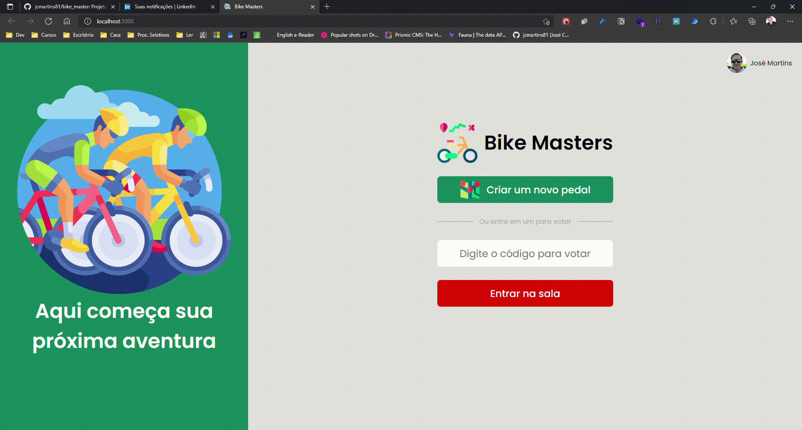

# 
 Olá! Bem-vindo ao meu mundo! 

## Sobre Mim!

Se chegou até aqui, já sabe que me chamo **José Carlos Martins** e que sou desenvolvedor **Fullstack Javascript**.
Também já deve ter notado que o meu e-mail é [📧 jcmartins81@outlook.com](mailto:jcmartins81@outlook.com) e que o meu linkedin é
[www.linkedin.com/in/jcmartins81](https://www.linkedin.com/in/jcmartins81).

## O que talvez você não saiba:

### Áreas de conhecimento:

### Formação:

- MBA em Desenvolvimento FullStack pelo [Instituto de Gestão e Tecnologia da Informação](https://www.igti.com.br/)

- Graduado em Matemática Licenciatura pela [Universidade Federal de Santa Catarina](https://ufsc.br/);

###

###     

# Projetos Recentes:

## [Ignews](https://github.com/jcmartins81/ignews) 
- Projeto criado no bootcamp de ReactJS da [RocketSeat](https://www.rocketseat.com.br/).
- Tecnologias utilizadas:
  
  - [NextJs](https://nextjs.org/) no frontend;
  - [Sass](https://sass-lang.com/) para estilização;
  - [Stripe](http://stripe.com/) para controle de pagamentos;
  - [Prismic](https://www.prismic.io/) para a publicação de posts;
  - [faunadb](https://fauna.com/) para acesso ao banco de dados;

 

#
## [Bike-Masters](https://github.com/jcmartins81/bike_master)
- Projeto de Conclusão do curso MBA em Desenvolvimento FullStack do [Instituto de Gestão e Tecnologia da Informação](https://www.igti.com.br/).
- Tecnologias Utilizadas:
    
    - [ReactJS](https://reactjs.org/) no frontend;
    - [Sass](https://sass-lang.com/) para estilização;
    - [NodeJS](http://nodejs.org/) no backend;
    - [MongoDB](https://www.mongodb.com.br/) como banco de dados;
    - [Docker](https://www.docker.com/) para rodar as partes da aplicação;
  

 

#
## [Controle de Estoque](https://github.com/jcmartins81/inventory_control_full)
- Aplicação criada para controle de estoque de produtos.
- Tecnologias Utilizadas:
    
  - No Frontend:
    - [ReactJS](https://reactjs.org/);
    - Frontend rodando no Azure com [Azure Static Web Apps](https://azure.microsoft.com/pt-br/services/app-service/static/).
  - No Backend:
    - Api rodando em [NodeJS](http://nodejs.org/);
    - Autenticação com [JWT](https://jwt.io/);
    - Validação de tokens utilizando chaves públicas e privadas;
    - Banco MongoDb com [Mongoose](https://mongoosejs.com/).
  
  

 